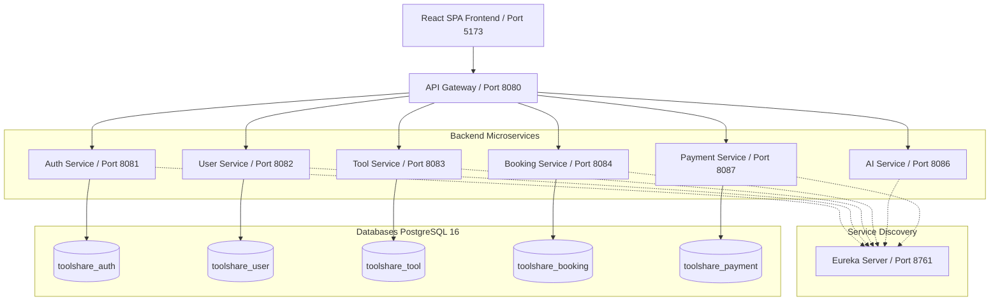

# ToolShare 🛠️

> **A Polyglot Microservices-based Peer-to-Peer Tool Sharing & Rental Platform**

[](https://www.oracle.com/java/)
[](https://spring.io/projects/spring-boot)
[](https://react.dev/)
[](https://www.typescriptlang.org/)
[](https://vitejs.dev/)
[](https://tailwindcss.com/)
[](https://www.postgresql.org/)
[](https://www.docker.com/)

---

## 📌 Overview

**ToolShare** is a modern, full-stack microservices platform designed to enable peer-to-peer tool sharing within communities. It connects tool owners with neighbors in need of specialized equipment, reducing consumer waste, saving money, and fostering local community collaboration.

The platform features a **Spring Boot microservices architecture** operating behind a centralized API Gateway and Service Discovery registry, coupled with a responsive **React + TypeScript SPA** enriched with AI-powered tool recommendations using Google Gemini.

---

## ✨ Key Features

- **🔐 User Authentication & Authorization**: Secure JWT-based authentication, OAuth2 Google single sign-on, role-based access control (RBAC).
- **🧰 Tool Catalog & Listing Management**: Add, update, search, and filter tools by category, rate, and availability.
- **🤖 AI-Powered Recommendations & Smart Search**: Integrated Google Gemini AI for intelligent tool matching, recommendations, and search queries.
- **📅 Booking & Reservation Lifecycle**: Seamless tool rental workflow with status tracking (requested, confirmed, active, completed, cancelled).
- **💳 Payment & Payout Gateway**: Transaction management and automated payout handling for tool owners.
- **⚡ Modern Responsive UI**: Dynamic, fast React SPA built with Vite, Tailwind CSS, and Lucide icons.
- **🌐 Microservice Discovery & API Gateway**: Centralized Netflix Eureka server for dynamic service discovery and Spring Cloud Gateway for unified routing.

---

## 🏗️ System Architecture



---

## 🧩 Microservices & Ports Summary

| Service | Port | Description | Database |
| :--- | :--- | :--- | :--- |
| **Eureka Server** | `8761` | Service Registry & Discovery | *N/A* |
| **API Gateway** | `8080` | Unified API Entry Point & Routing | *N/A* |
| **Auth Service** | `8081` | Authentication, JWT, OAuth2 | `toolshare_auth` |
| **User Service** | `8082` | User Profiles & Account Management | `toolshare_user` |
| **Tool Service** | `8083` | Tool Listings, Categories & Availability | `toolshare_tool` |
| **Booking Service** | `8084` | Tool Reservations & Rentals | `toolshare_booking` |
| **AI Service** | `8086` | Gemini-powered Recommendations & Search | `toolshare_ai` |
| **Payment Service** | `8087` | Payment Processing & Payouts | `toolshare_payment` |
| **Frontend SPA** | `5173` | React 18 + TypeScript + Vite | *N/A* |

---

## 🚀 Getting Started

### Prerequisites

Ensure you have the following installed on your machine:
- **Java Development Kit (JDK) 21**
- **Apache Maven 3.8+**
- **Node.js 18+** & **npm 9+**
- **Docker** & **Docker Compose**

---

### Environment Setup

1. Clone the repository:
   ```bash
   git clone https://github.com/luvanidixit101/toolshare-microservices.git
   cd toolshare-microservices
   ```

2. Configure environment variables:
   ```bash
   cp .env.example .env
   ```
   *Update variables in `.env` (such as `JWT_SECRET`, `GEMINI_API_KEY`, and `GOOGLE_CLIENT_ID`) for your local setup.*

---

### Running via Docker Compose (Recommended)

To start PostgreSQL and the infrastructure services:
```bash
# Start infrastructure containers
docker-compose up -d
```

To run the production-oriented stack:
```bash
docker compose -f docker-compose.prod.yml build
docker compose -f docker-compose.prod.yml up -d
```

---

### Running Services Locally for Development

#### 1. Backend Microservices

Build all microservices:
```bash
mvn -f backend/pom.xml clean install
```

Start the services in the recommended order:
1. **Eureka Server**: `mvn -f backend/eureka-server/pom.xml spring-boot:run`
2. **API Gateway**: `mvn -f backend/api-gateway/pom.xml spring-boot:run`
3. **Core Services**:
   - Auth Service: `mvn -f backend/auth-service/pom.xml spring-boot:run`
   - User Service: `mvn -f backend/user-service/pom.xml spring-boot:run`
   - Tool Service: `mvn -f backend/tool-service/pom.xml spring-boot:run`
   - Booking Service: `mvn -f backend/booking-service/pom.xml spring-boot:run`
   - AI Service: `mvn -f backend/ai-service/pom.xml spring-boot:run`
   - Payment Service: `mvn -f backend/payment-service/pom.xml spring-boot:run`

#### 2. Frontend Application

Navigate to the `frontend/` directory, install dependencies, and launch the dev server:
```bash
cd frontend
npm install
npm run dev
```

Access the frontend at `http://localhost:5173`.

---

## 🛠️ API & Developer Documentation

- **Interactive API Documentation (Swagger/OpenAPI)**:
  - Auth Service: [http://localhost:8081/swagger-ui.html](http://localhost:8081/swagger-ui.html)
  - User Service: [http://localhost:8082/swagger-ui.html](http://localhost:8082/swagger-ui.html)
  - Tool Service: [http://localhost:8083/swagger-ui.html](http://localhost:8083/swagger-ui.html)
  - Booking Service: [http://localhost:8084/swagger-ui.html](http://localhost:8084/swagger-ui.html)
  - AI Service: [http://localhost:8086/swagger-ui.html](http://localhost:8086/swagger-ui.html)
  - Payment Service: [http://localhost:8087/swagger-ui.html](http://localhost:8087/swagger-ui.html)
- **Eureka Service Dashboard**: [http://localhost:8761](http://localhost:8761)
- **Postman Collection**: Postman collection and environment files are available in the root folder (`toolshare-postman-collection.json`).

---

## 🧪 Testing & Code Quality

#### Backend
```bash
# Run tests for all backend microservices
mvn -f backend/pom.xml test
```

#### Frontend
```bash
cd frontend

# Linting
npm run lint

# TypeScript Type checking
npm run typecheck

# Production Build Test
npm run build
```

---

## 📁 Repository Structure

```
toolshare-microservices/
├── backend/                  # Java 21 / Spring Boot Microservices
│   ├── eureka-server/        # Discovery Server (Port 8761)
│   ├── api-gateway/          # Spring Cloud Gateway (Port 8080)
│   ├── auth-service/         # User Auth & JWT Management (Port 8081)
│   ├── user-service/         # User Profile Management (Port 8082)
│   ├── tool-service/         # Tool Listings & Inventory (Port 8083)
│   ├── booking-service/      # Rental Reservations & Lifecycle (Port 8084)
│   ├── ai-service/           # Gemini AI Recommendation Service (Port 8086)
│   └── payment-service/      # Payment Processing & Payouts (Port 8087)
├── frontend/                 # React 18 + TypeScript + Vite SPA
├── docker/                   # Database init scripts & configuration
├── docker-compose.yml        # Development Docker Compose configuration
├── docker-compose.prod.yml   # Production Docker Compose configuration
└── README.md                 # Project README
```

---

## 📄 License

This project is open source and available under the [MIT License](LICENSE).
