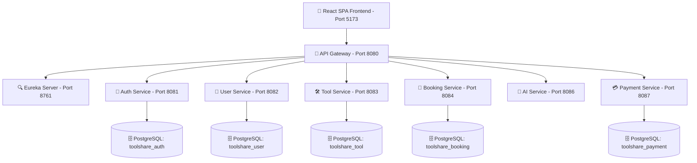

# ToolShare 🛠️

> A P2P equipment & tool sharing microservices platform built with Java 21, Spring Boot, React, TypeScript, and Docker.

[](https://www.oracle.com/java/)
[](https://spring.io/projects/spring-boot)
[](https://react.dev/)
[](https://www.typescriptlang.org/)
[](https://vitejs.dev/)
[](https://tailwindcss.com/)
[](https://www.postgresql.org/)
[](https://www.docker.com/)

---

## 📌 Overview

**ToolShare** is a full-stack, polyglot microservices platform designed for community-driven equipment and tool sharing. It allows users to list power tools, garden equipment, construction machinery, and household tools for rent or peer-to-peer borrowing.

The backend is engineered with **Spring Boot microservices**, utilizing **Spring Cloud Netflix Eureka** for service registry and **Spring Cloud API Gateway** for unified request routing. The frontend is a modern single-page application built with **React**, **TypeScript**, **Tailwind CSS**, and **Vite**.

---

## ✨ Features

- 🔐 **Authentication & Security**: JWT token management, refresh tokens, role-based access, and Google OAuth2 integration.
- 🛠️ **Tool Catalog & Management**: List, search, edit, and filter tools by category, availability, and location.
- 📅 **Smart Booking & Reservations**: Seamless rental booking calendar, status tracking, and reservation history.
- 🤖 **AI Recommendations**: Intelligent tool recommendations and search powered by AI Service.
- 💳 **Payments & Payouts**: Secure payment transaction processing and host payout tracking.
- 🌐 **Responsive React SPA**: Modern UI styled with Tailwind CSS and Lucide icons, supporting both mock mode and full backend integration.
- 🚦 **Resilient Microservice Architecture**: Decoupled domain databases, Spring Actuator monitoring, and OpenAPI/Swagger documentation.

---

## 🏗️ Architecture



---

## ⚙️ Microservices Overview

| Microservice | Port | Database | Primary Responsibility |
| :--- | :---: | :---: | :--- |
| **Eureka Server** | `8761` | N/A | Service discovery registry and health dashboard |
| **API Gateway** | `8080` | N/A | Single entry point, CORS, routing to downstream services |
| **Auth Service** | `8081` | `toolshare_auth` | Authentication, JWT token generation, OAuth2 |
| **User Service** | `8082` | `toolshare_user` | User profiles, account settings, user metadata |
| **Tool Service** | `8083` | `toolshare_tool` | Tool listings, availability, rental pricing |
| **Booking Service** | `8084` | `toolshare_booking` | Reservation bookings, scheduling, status updates |
| **AI Service** | `8086` | N/A | Smart recommendations, automated matching |
| **Payment Service** | `8087` | `toolshare_payment` | Payment transactions, invoices, payout management |
| **Frontend** | `5173` | N/A | React SPA with Vite & Tailwind CSS |

---

## 🧰 Tech Stack

### Backend
- **Language**: Java 21
- **Framework**: Spring Boot 3.3.5 (API Gateway: 3.2.5)
- **Security**: Spring Security, JWT, OAuth2 Resource Server
- **Data Access**: Spring Data JPA, Hibernate, PostgreSQL 16
- **Service Discovery & Gateway**: Spring Cloud Eureka, Spring Cloud Gateway
- **Documentation**: SpringDoc OpenAPI (Swagger UI)
- **Utilities**: Lombok, Spring Actuator

### Frontend
- **Framework**: React 18
- **Language**: TypeScript 5.5
- **Build Tool**: Vite 5.4
- **Styling**: Tailwind CSS 3.4
- **HTTP Client**: Axios
- **Icons**: Lucide React
- **Integration**: Supabase JS Client & REST APIs

### Infrastructure & Operations
- **Containerization**: Docker & Docker Compose
- **Database**: PostgreSQL 16 Alpine (Multi-database initialization script)
- **API Testing**: Postman Collection & Environment included

---

## 🚀 Quick Start Guide

### Prerequisites

Ensure you have the following installed on your machine:
- **Java Development Kit (JDK) 21** or later
- **Apache Maven 3.8+**
- **Node.js 18+** & **npm**
- **Docker & Docker Compose**

---

### Step 1: Clone the Repository

```bash
git clone https://github.com/your-username/ToolShare.git
cd ToolShare
```

---

### Step 2: Environment Configuration

Copy the sample environment file to create your `.env` file:

```bash
cp .env.example .env
```

Ensure default environment variables match your local environment setup:
- `POSTGRES_USER=admin`
- `POSTGRES_PASSWORD=admin`
- `JWT_SECRET=your-secure-jwt-secret-key-here`

---

### Step 3: Start Infrastructure (PostgreSQL)

Launch the multi-database PostgreSQL container using Docker Compose:

```bash
docker-compose up -d
```

*This automatically initializes all 5 microservice databases (`toolshare_auth`, `toolshare_user`, `toolshare_tool`, `toolshare_booking`, `toolshare_payment`).*

---

### Step 4: Build & Launch Backend Microservices

1. **Build all backend microservices:**
   ```bash
   mvn -f backend/pom.xml clean install
   ```

2. **Start Service Discovery (Eureka Server):**
   ```bash
   mvn -f backend/eureka-server/pom.xml spring-boot:run
   ```
   *Dashboard available at: `http://localhost:8761`*

3. **Start API Gateway:**
   ```bash
   mvn -f backend/api-gateway/pom.xml spring-boot:run
   ```

4. **Start Microservices** (run each in a terminal or background process):
   ```bash
   mvn -f backend/auth-service/pom.xml spring-boot:run
   mvn -f backend/user-service/pom.xml spring-boot:run
   mvn -f backend/tool-service/pom.xml spring-boot:run
   mvn -f backend/booking-service/pom.xml spring-boot:run
   mvn -f backend/ai-service/pom.xml spring-boot:run
   mvn -f backend/payment-service/pom.xml spring-boot:run
   ```

---

### Step 5: Start Frontend Development Server

```bash
cd frontend
npm install
npm run dev
```

Open your browser and navigate to **`http://localhost:5173`**.

---

## 📖 API Documentation & Swagger

Once the microservices are running, interactive Swagger UI documentation is accessible at:

- 🔓 **Auth Service**: `http://localhost:8081/swagger-ui.html`
- 👤 **User Service**: `http://localhost:8082/swagger-ui.html`
- 🛠️ **Tool Service**: `http://localhost:8083/swagger-ui.html`
- 📅 **Booking Service**: `http://localhost:8084/swagger-ui.html`
- 🤖 **AI Service**: `http://localhost:8086/swagger-ui.html`
- 💳 **Payment Service**: `http://localhost:8087/swagger-ui.html`

All requests routed through API Gateway (`http://localhost:8080/api/...`) follow these routing conventions:

```text
/api/auth/**      → Auth Service (8081)
/api/users/**     → User Service (8082)
/api/profile/**   → User Service (8082)
/api/tools/**     → Tool Service (8083)
/api/bookings/**  → Booking Service (8084)
/api/ai/**        → AI Service (8086)
/api/payments/**  → Payment Service (8087)
```

---

## 🧪 Testing & Postman

A pre-configured Postman Collection and Environment are provided in the repository root:

- `toolshare-postman-collection.json`
- `toolshare-postman-environment.json`

Import both files into [Postman](https://www.postman.com/) to start testing all REST API endpoints out of the box.

---

## 📂 Project Structure

```text
ToolShare/
├── backend/
│   ├── ai-service/        # Recommendation & smart matching service
│   ├── api-gateway/       # Spring Cloud API Gateway
│   ├── auth-service/      # Authentication & JWT security service
│   ├── booking-service/   # Reservation & booking service
│   ├── eureka-server/     # Service registry & discovery
│   ├── payment-service/   # Transaction & payout service
│   ├── tool-service/      # Tool inventory service
│   ├── user-service/       # User profile service
│   └── pom.xml            # Parent Maven configuration
├── docker/
│   └── postgres/
│       └── init-databases.sql # SQL script creating service databases
├── frontend/
│   ├── src/
│   │   ├── components/    # Reusable UI components
│   │   ├── context/       # Auth & app contexts
│   │   ├── pages/         # Page views (Auth, Tools, Bookings, Admin, etc.)
│   │   ├── services/      # Axios API integration services
│   │   ├── types/         # TypeScript interfaces & types
│   │   └── App.tsx        # Router & primary component
│   ├── package.json
│   └── vite.config.ts
├── docker-compose.yml     # Infrastructure services configuration
├── .env.example           # Environment template
└── AGENTS.md              # AI agent guidelines & internal setup specs
```

---

## 🤝 Contributing

Contributions, issues, and feature requests are welcome!

1. Fork the Project
2. Create your Feature Branch (`git checkout -b feature/AmazingFeature`)
3. Commit your Changes (`git commit -m 'Add some AmazingFeature'`)
4. Push to the Branch (`git push origin feature/AmazingFeature`)
5. Open a Pull Request

---

## 📝 License

Distributed under the MIT License.
